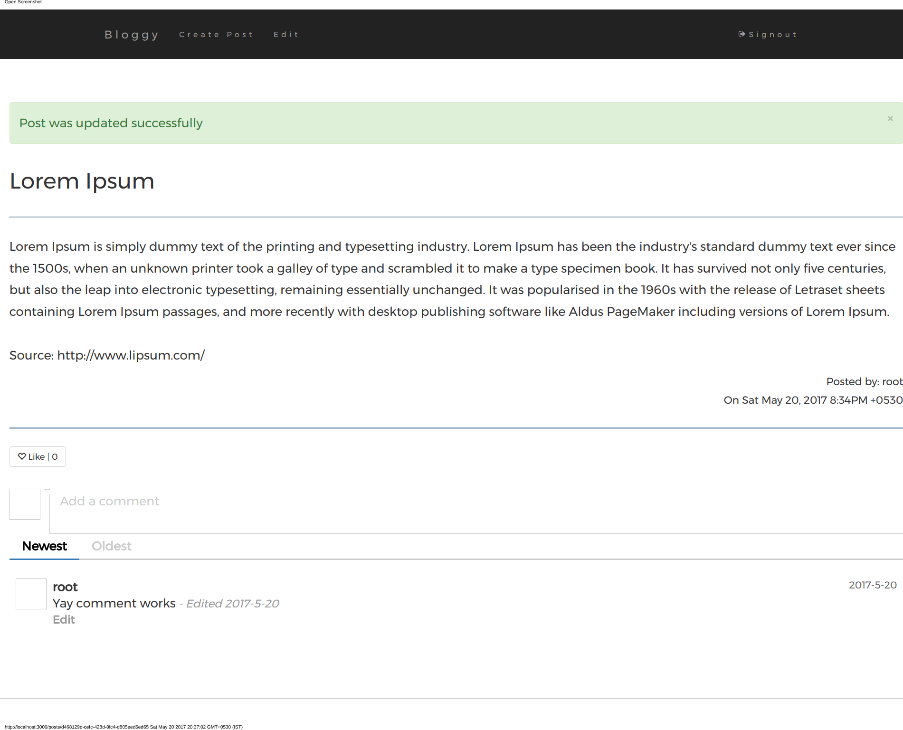

# AppStory
This is a port of [AppStory](https://github.com/jnoortheen/appstory) to Go. A multi-user blog using 
[go-buffalo](https://github.com/gobuffalo/buffalo).

## Tech Stack
- Go
- Buffalo
- Jquery Comments
- Bootstrap3

## Database Setup

using sqlite3 as data backend

### Create Your Databases

Ok, so you've edited the "database.yml" file and started sqlite3, now Buffalo can create the databases in that file for you:

	$ buffalo db create -a

To run all pending migrations

	$ buffalo db migrate up

## Starting the Application

Run the binary found here at [dist](./dist)
	$ ./muserblog

If you point your browser to [http://127.0.0.1:3000](http://127.0.0.1:3000) blog home page.

## Functionality
A small micro blog with below features
- User Accounts:
  Users account activity is implemented using secured cookies. Usernames are maintained to be unique. The password 
  is stored as Hash values with salted compound.
- Registered users can post to the blog. That post can later be edited or deleted by the author.
- Commenting on posts
- Like/Dislike posts

## Screencap
